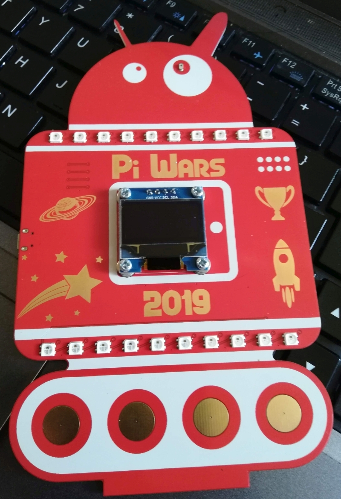

# Pi Wars 2019 Trophy

## Introduction
The Pi Wars 2019 trophy has an ATmega chip on-board, which means that to program it, you will need to use Arduino C code.
To code and upload your program to the Trophy, you will need to use a piece of software called the Arduino IDE.
Don't worry if you're not used to programming Arduinos. The syntax is different but the concepts are the same. There
are numerous tutorials out there which explain the basics. Programs on Arduinos are called "sketches" and we have supplied
and uploaded a sample sketch for you to play around with.

## Installing the Arduino IDE
[Download the Arduino IDE for your computer from the Arduino website](https://www.arduino.cc/en/main/software)

Install the software and then run the IDE.

*Please note, if you’re on a Linux machine, you’ll need to run the IDE as root by doing `sudo ./arduino` in the Arduino program directory.*
*Do this **before** you open the sketch, and before you add the Libraries otherwise you’ll need to do it twice.*

## Installing the libraries
In order to take advantage of the LEDs and the OLED display on the trophy, you will need to install a couple of libraries.

Navigate using the main menu to:
`Sketch->Include library->Manage libraries`

Allow the list to update. Then search for `FastLED` by Daniel Garcia.
Install it. (This allows you to program the LEDs).

Search for `U8g2` by Oliver. Install it. (This allows you to control the OLED display)

Then close the Manager.

## Uploading a sketch
To program the Trophy from the Arduino IDE, use `Arduino Uno` as the board and choose `Arduino as ISP` as the programmer.

You’ll need to change the Port in the tools menu. The best thing to do is to check the list before you plug in the trophy, plug in the trophy
and then see what’s changed on the list. For instance, on my Linux laptop, `/dev/ttyUSB0` comes up and on my
Windows laptop, `COM3` comes up.

Once you're ready to upload, plug the Trophy into your computer using a microUSB cable, wait a few seconds while the Trophy boots up and then
press the upload button on the Arduino IDE. Any errors will appear in the log at the bottom of the IDE.

### Please note - USB cables
*Not all USB cables are the same!*
You need one that has a **data line**. These tend to be the thicker, more robust USB cables.
If no port appears, you’ve got a cable without a data line.
Data line USB cables tend to come with mobile phones as they use them to sync with your main computer.
Generally you can find these cables by explicitly searching, for example, on eBay for a *micro USB data cable*.

## About the sample sketch
You can download the sample sketch from the GitHub repository and then open it in the Arduino IDE. It is heavily commented and this
should help you understand what's going on. Here are some notes on how the sample sketch works in terms of button presses and
functionality:
* On boot, the sketch will flash through primary colours and then settle.
* The buttons are numbered 0-3, starting from the left.
* Button 0 will start a Larson Scanner function. You should see red lights scanning back and forth. Pressing button 3 will
stop the scanner.
* Button 1 will start a Broadway Lights function. You should see white lights flashing. If you're susceptible to flashing lights, you
should probably steer clear of this one! Pressing button 3 will stop it.
* Button 2 will just show blue lights. These will be brighter when the light sensor in the eye of the Robot is in the dark and dimmer when
it is bright. Any button will exit.
* Button 3 will show a Rainbow Pattern back and forth on the LEDs. Button 2 will stop the Rainbow.
* Pressing buttons 0 and 1 together will make the LEDs go light purple. This is just to show you how combining buttons can trigger alternative functions.
* Pressing buttons 2 and 3 together will turn all the LEDs off.
* LED brightness is controlled by the maxBrightness variable - this is set deliberately low to start with as the LEDs can be *very* bright!

## A disclaimer
I, Mike Horne (@recantha) wrote the majority of this code. I am not the world's best Arduino/microcontroller programmer, so there's bound
to be ways in which you can improve things! Have fun!